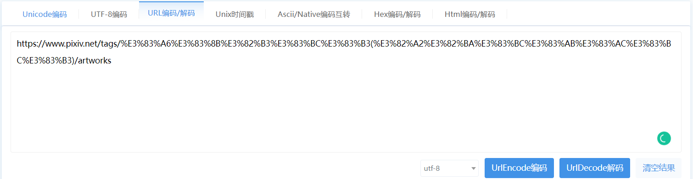

## Features

1. Downloading pictures with multi-processes quickly 
2. Specifying tags for crawling
3. Filtering works with unwanted tags out
4. Filtering works for downloading by number of likes
5. Choosing whether to download AI generated features

## Installation Steps

1. Clone the project into your environment.
2. Run `pip install -r requirements.txt`.
3. Open your VPN and start global proxy to **ensure the script can get access to pixiv.net**. (this step is necessary for Chinese users)
4. Follow instructions in [cookie instruction](https://github.com/MiraclesinWang/Advanced-Pixiv-Crawler/blob/main/cookie instruction.md). Place your cookie in the `${your cookie here}` in default.json.
5. Specific a tag and output directory for downloading, and set other optional arguments as you need. Then run the script. Example:

```
python pixiv_crawler.py \
--tag %E5%88%BB%E6%99%B4 \
--output_dir ./output \
--max_num 300 \
--max_page_num 20 \
--force_ai 2 \
--process_num 10 \
--like_threshold 0 \
--must_in_tags loli %E5%A5%B3%E3%81%AE%E5%AD%90 \
--must_out_tags R-18 
```

6. Wait for downloading and enjoy pictures of your wife! 

## How to get tag name

1. Firstly, search for tags on pixiv.net. 

   

2. Then, copy the url into the text editor or utf-16 decoder(https://tool.chinaz.com/tools/urlencode.aspx), which will automatically decode it for you. 

   

   

## TODO

1. Add pyqt gui (maybe...)
2. Add implementation for sorting work by popularity with premium (which I still don't have yet)
