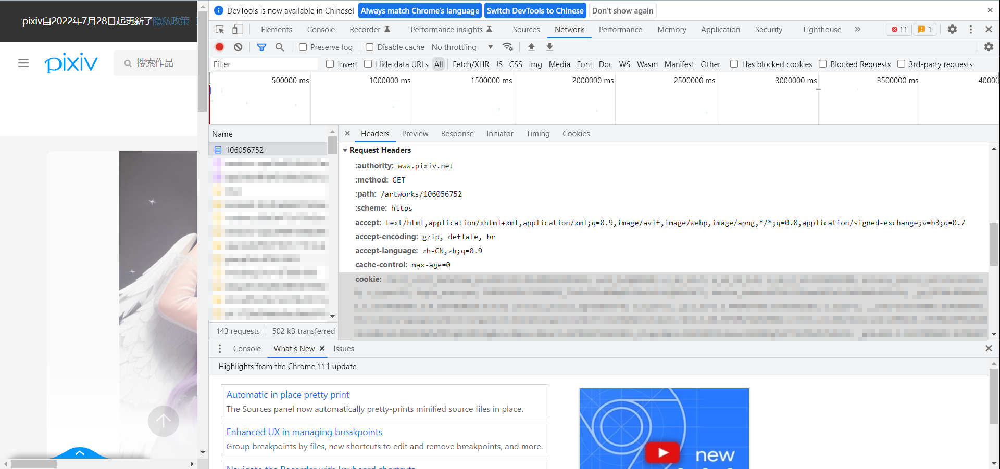

# Cookie Query Steps

1. Randomly open a work of pixiv.net. For example, https://www.pixiv.net/artworks/106056752. 

2. Open one image in a new tab. Then open your development tools->Network->homepage(first file after refreshing the page)->Headers->cookie

   

1. Paste your cookie into default.yaml.